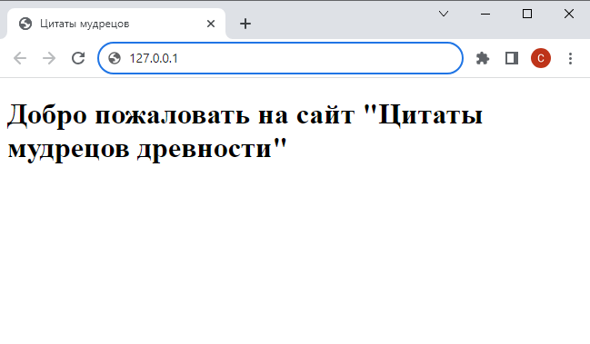

# Шаг 2 

### Flask проект

Создайте веб-приложение, используя фреймворк Flask. 

На первом этапе посетителям доступна только главная страница. Она должна содержать единственный элемент - заголовок ```Добро пожаловать на сайт "Цитаты мудрецов древности"```

Используйте шаблон, код главной страницы должен быть *валидным*

<kbd>
    
</kbd>