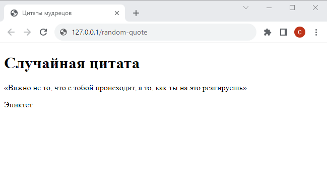
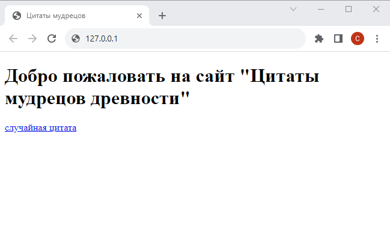

# Шаг 3

### Страница со случайной цитатой

Реализуйте возможность отображения специальной страницы по адресу `127.0.0.1/random-quote`

На данном этапе отобразите на этой странице *фиксированный* заголовок и текст (пока не используйте переменные):

<kbd>
    
</kbd>

Фактическое отображение случайной цитаты при каждом обновлении страницы будет добавлено позже.

Реализуйте возможность перехода на эту страницу с главной (добавьте ссылку):

<kbd>
    
</kbd>

