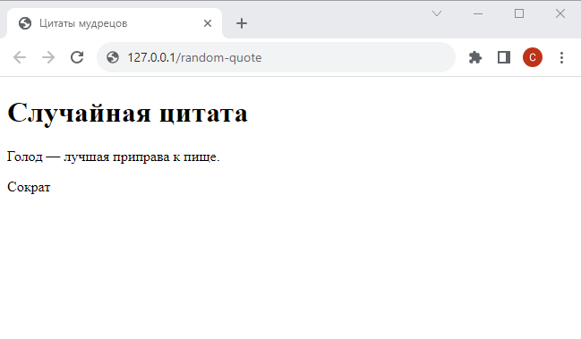

# Шаг 4

### Чтение файла, переменные

Создайте в проекте модуль (`.py` файл) с именем `utils.py` (utilities - утилиты) или `helpers.py` (helpers - вспомогательные функции). Разместите в нем функции для получения цитат и авторов, написанные на Шаге 1 (`get_author_quotes`, `get_all_quotes` и т.д.)

Также поместите в каталог Flask проекта [**файл `quotes.txt`**](quotes.txt)

Импортируйте необходимые функции в основной модуль Flask приложения и используя их реализуйте отображение случайной цитаты и автора на соответствующей странице (замените в шаблоне фиксированный текст на переменные)

<kbd>
    
</kbd>

При каждом обновлении страницы должна отображаться случайная цитата (и ее автор) из файла `quotes.txt`