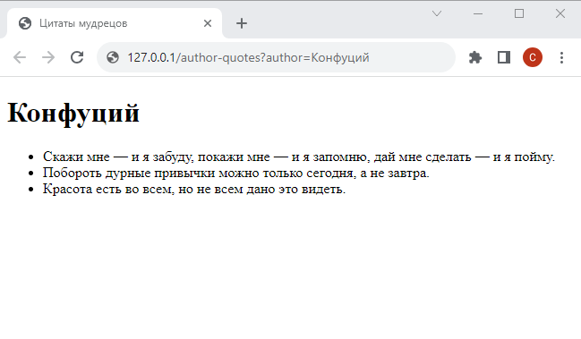

# Шаг 6

### Аргументы запроса и цикл в шаблоне

Реализуйте возможность просмотра на отдельной странице c адресом `.../author-quotes` всех цитат одного автора (предполагается, что запросы к URL будут содержать аргумент `author`).

Пример URL:
`http://127.0.0.1/author-quotes?author=Конфуций`

<kbd>
    
</kbd>
