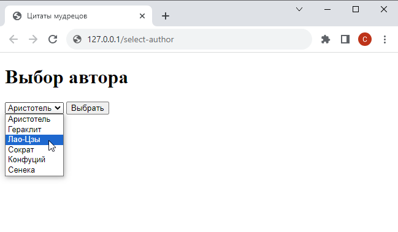

# Шаг 7

### Форма с выпадающим списком

Разместите на отдельной странице c адресом `.../select-author` форму, содержащую единственное поле - выпадающий список. Выпадающий список должен содержать имена всех авторов цитат из файла `quotes.txt`

<kbd>
    
</kbd>

При нажатии кнопки `Выбрать` должна открываться страница с цитатами выбранного автора (реализованная на предыдущем шаге)